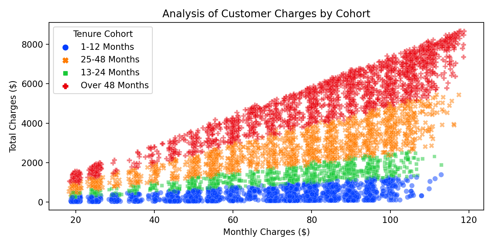

# Client Churn Predictor

_In this project, we use existing telecom customer data to build and compare several classification models for predicting customer churn._

* Developed classification models using customer data from a telecommunications company containing 7032 observations (rows, each representing unique customers) and 21 fields (features + target)
* Using historical data about the customers, such as their tenure with the telecom service, their contract type, etc., and data regarding customer churn, we built classifiers for predicting future customer churn
* Performed exploratory data analysis to understand the relationships between contract type, charges (fees), services, and tenure, and how these factors affected the company's churn rate
* Used cohort analysis to investigate the differences among cohorts: we found that customers on a one-year or a two-year contract were much less likely to churn than customers who are on month-to-month contracts
* Employed various tree-based methods, such as Single Decision Trees, Random Forests, AdaBoost classifier, and Gradient Boosting, as well as Support Vector Machines and K-Nearest Neighbors to perform this classification task
* Using a grid search with 10-fold cross validation on the AdaBoost classifier, we found that the optimal learning rate and number of estimators were 0.25 and 100, respectively: this leads to an accuracy of 82% and similar recall (between 80% and 83%) 

